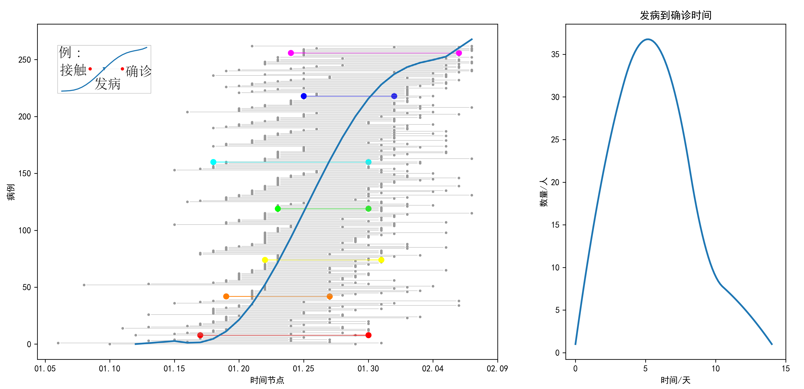

这里对深圳的发病数据进行了可视化，

数据来自深圳市卫生健康委员会.疫情信息[http://wjw.sz.gov.cn/yqxx](http://wjw.sz.gov.cn/yqxx/)，截止到2月9日。

在传播模型中，疾病的潜伏期亦是需要考虑的因素之一。据流行学调查，NCP的潜伏期为1-14天。我们通过手动标注深圳市的200余起病例[3]进行可视化，观察不同时期疾病感染、发病、确诊三个阶段的时间关联性，验证疾病的部分特点。 

在这幅可视化图中，横轴代表时间。每条水平线上，蓝色分界线左右颜色相同的两个点，对应同一病例。蓝色分界线表示发病的时间；蓝线左侧，表示此人接触可疑人员的时间；蓝线右侧，表示此人被确诊的时间。从发病到确诊的时间，就是蓝线到右侧点的水平距离。

由图中很容易发现，疾病的确诊，随着时间推移越来越迅速。由一开始的最少5天，缩短为后期的1-2天，也验证了医疗诊断条件的改善。从接触到发病，平均时间5.3天，这可以认为是疫情在深圳的平均潜伏期。右图表示从发病到确诊的时间，平均5.8天。