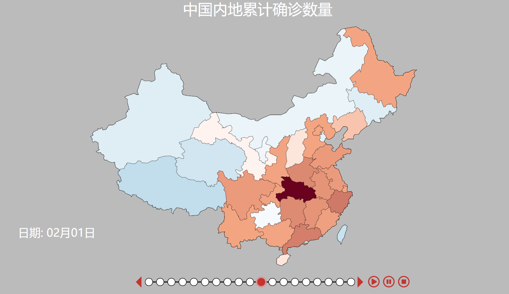
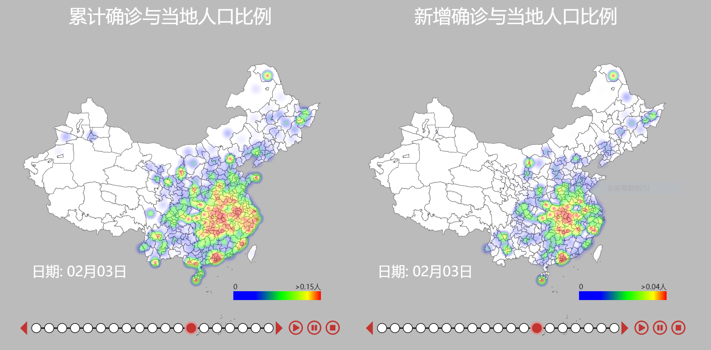
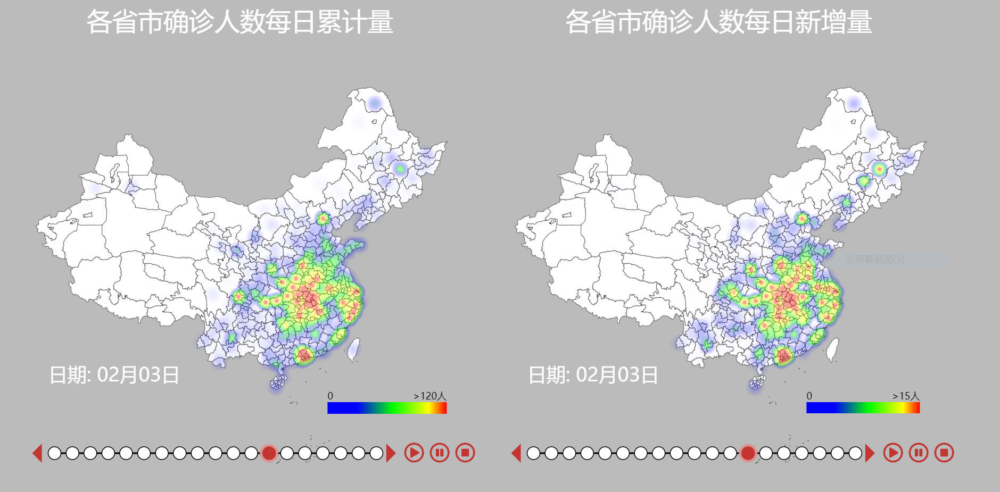

## 面向新冠疫情的数据可视化分析

本项目面向新冠疫情的数据，进行地图可视化分析。疫情模拟预测部分在 [Place Holder]

对于可视化与模拟预测的详细解读，已发布在微信公众号平台上。 [公众号链接](https://mp.weixin.qq.com/s?__biz=MzU3NTczNzI2MQ==&mid=2247484006&idx=1&sn=57d8cd06d511fdc3d22d87e0842f6b9b&chksm=fd1fdea4ca6857b2810933007cca58874c1b522b5b02a21c91394cab25dd5b07f74803216c04&mpshare=1&scene=1&srcid=&sharer_sharetime=1581345787110&sharer_shareid=5c5431824882695847df7d3856c69e42&key=3a0238dfe83dd392ff5695d901e568664b82efac5b997ed3c90683155f9069d0c1cd95cc8d049910335f7cb4fad736dcb98f09f6ff8561feb2c091673d69e57f44f0c892d744da72a8bba9c2d7d242eb&ascene=1&uin=MTkwNTgyNjU4NA%3D%3D&devicetype=Windows+10&version=6208006f&lang=zh_CN&exportkey=AR16cMvN776UQwQfheM66CI%3D&pass_ticket=QsCKKAtwXsF8sfr61Sarij0LipAb55R4ijUFosqFAs0rMrXy4EiKmA4VdyoOG0E9)

此项目由北京大学前沿计算研究中心http://cfcs.pku.edu.cn/ [陈宝权教授](http://cfcs.pku.edu.cn/baoquan/)组完成。

更多的数据和可视化将陆续更新。

## 效果展示

中国内地各省累计确诊数量图，颜色越深，代表感染人数越多。

各地区累计确诊比例与每日新增比例热度图

累计确诊人数、每日新增人数热度图

从湖北流出人口数量统计图，颜色越深，流出人口越多。

## 数据来源

1. GitHub： [疫情状况的时间序列数据仓库](https://github.com/BlankerL/DXY-2019-nCoV-Data) 
2. 百度：[百度地图慧眼-百度迁移](http://qianxi.baidu.com/)

所采用的数据截止至2020年2月9日。

## 调用开源库

本项目使用了[d3.js](https://d3js.org/) 和 [heatmap.js](https://www.patrick-wied.at/static/heatmapjs/) 进行可视化。使用d3.js绘制地图和气泡图，使用heatmap.js绘制热力图。其中，`D3` 结合了强大的可视化交互技术以及数据驱动 `DOM` 的技术, 可以借助于现代浏览器的强大功能，自由地对数据进行可视化。使用了[jQuery](https://jquery.com/)进行辅助操作。

## 目录结构

data：具体数据。其中

​	420100_to_citys_20200101_20200203_percent.json：从武汉出发，到各个城市的人口百分比。

​	420100_to_provinces_20200101_20200203.json：从武汉出发，到各个城市的人口数量。

​	上面的人口迁移数据截至到2020年2月3日。

​	china.json：中国地图数据，精确到省级

​	city.json：中国地图数据，精确到市级

​	data-c.json：每个省市的确诊人数，截止到2020年2月9日。

​	population_city.json：各个城市的人口数量。

​	population_province1.json：各个省（直辖市、自治区）的人口数量。

​	traffic.parsed.json：从武汉出发的车次信息。

js：需要的JavaScript文件。在相关html文件里引用。

confirmcolor.html：中国内地累计确诊人数图。

totalandnew1.html：各地区累计确诊比例与每日新增比例热度图。

totalandnew2.html：累计确诊人数、每日新增人数热度图。

totalconfirm.html：各省市累计确诊人数热度图。

trafficcolor.html：从湖北流出人口数量统计图。